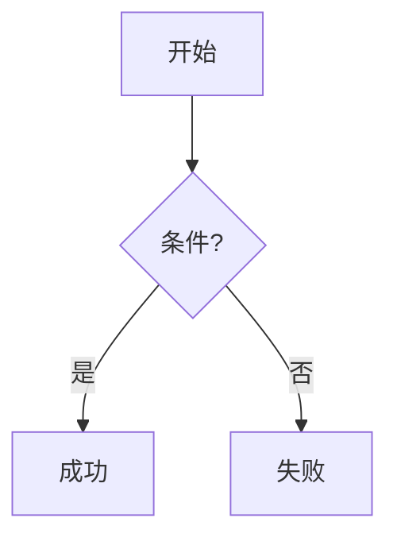
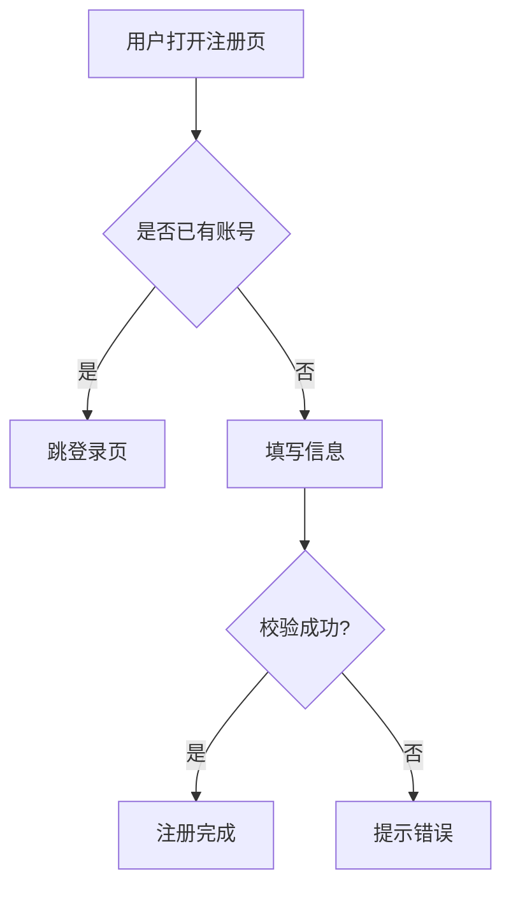
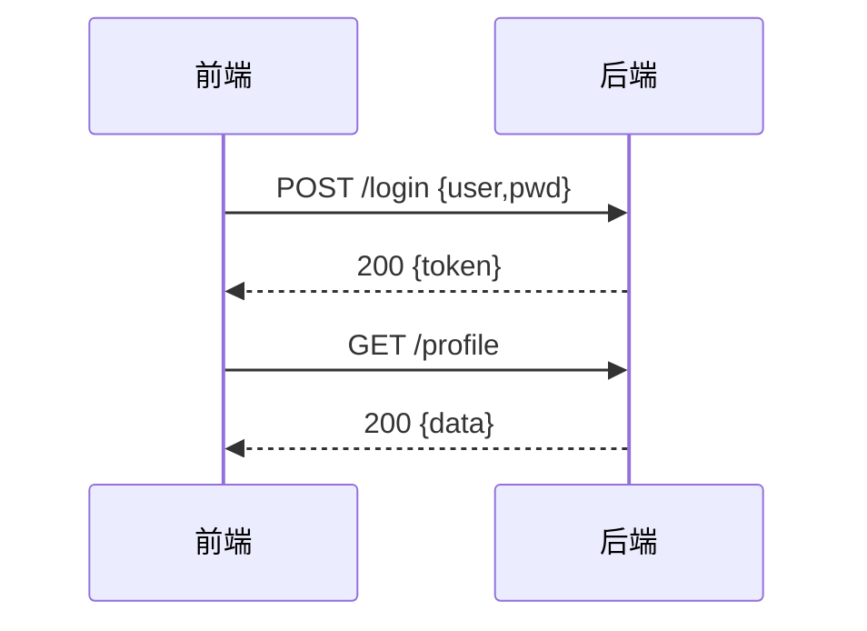
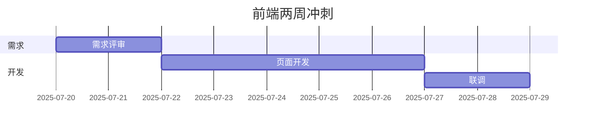

# 第4章 图表与流程图
## 1. Mermaid语法5分钟上手

**一句话认识 Mermaid**

---

Mermaid = “写代码画图”神器：用纯文本描述流程图、时序图、甘特图，浏览器原生支持，Typora、Obsidian、VS Code 一键渲染。


**三行画流程图**

---
复制以下代码到 Mermaid 在线编辑器
```markdown
flowchart TD
A[开始] --> B{条件?}
B -->|是| C[成功]
B -->|否| D[失败]
```
复制 → 粘 → 立刻出图！

**高频模板**

---

|图类型	|触发关键词	|场景示例|
|---|---|---|
|流程图	|flowchart	|注册流程|
|时序图	|sequenceDiagram	|接口调用|
|甘特图	|gantt	|项目排期|

## 2. 流程图/时序图/甘特图

**流程图模板（注册示例）**

---

```markdown
flowchart TD
A[用户打开注册页] --> B{是否已有账号}
B -->|是| C[跳登录页]
B -->|否| D[填写信息]
D --> E{校验成功?}
E -->|是| F[注册完成]
E -->|否| G[提示错误]
```



**时序图模板（API 调用）**

---

```markdown
sequenceDiagram
participant U as 前端
participant S as 后端
U->>S: POST /login {user,pwd}
S-->>U: 200 {token}
U->>S: GET /profile
S-->>U: 200 {data}
```



**甘特图模板（2 周冲刺)**

---

```markdown
gantt
title 前端两周冲刺
dateFormat  YYYY-MM-DD
section 需求
需求评审       :2025-07-20, 2d
section 开发
页面开发       :2025-07-22, 5d
联调           :2025-07-27, 2d
```




## 3. 图表在移动端自适应方案

**一句话原理**

---
把 Mermaid 生成的 `<svg>` 当成普通图片，只要给它加 `style="max-width:100%;height:auto"`，就能在手机横竖屏任意宽度下完整可见。

**三步搞定**

---

导出：Typora「文件→导出→SVG」
插入：
```markdown

```
完成：浏览器自动等比缩放，不糊不变形。
