# 第1章 Docker 基础
本文内容概览
```markmap
# Docker基础
## 1. Docker简介
- Docker简介
- Docker公司
- Docker 运行时与编排引擎
- 为什么要使用 Docker？
## 2. Docker安装
- win7、win8 系统安装Docker
- Window10安装Docker
- CentOS Docker 安装
- MacOS Docker 安装
```
## 1. Docker简介
**Docker简介**

---

Docker 是一个开源的应用容器引擎，基于 Go 语言 并遵从Apache2.0协议开源。

Docker 可以让开发者打包他们的应用以及依赖包到一个轻量级、可移植的容器中，然后发布到任何流行的 Linux 机器上，也可以实现虚拟化。

容器是完全使用沙箱机制，相互之间不会有任何接口（类似 iPhone 的 app）,更重要的是容器性能开销极低。

Docker 从 17.03 版本之后分为 CE（Community Edition: 社区版） 和 EE（Enterprise Edition: 企业版），我们用社区版就可以了。

**Docker公司**

---

Docker 标志如下图所示。
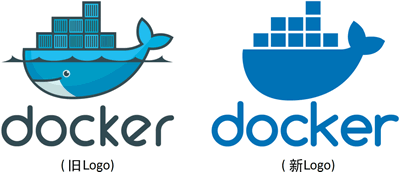
Docker标志
Docker 公司起初是一家名为 dotCloud 的平台即服务（Platform-as-a-Service, PaaS）提供商。

底层技术上，dotCloud 平台利用了 Linux 容器技术。

为了方便创建和管理这些容器，dotCloud 开发了一套内部工具，之后被命名为“Docker”。Docker就是这样诞生的！


> 提示：“Docker”一词来自英国口语，意为码头工人（Dock Worker），即从船上装卸货物的人。


**Docker 运行时与编排引擎**

---
多数技术人员在谈到 Docker 时，主要是指 Docker 引擎。
Docker 引擎是用于运行和编排容器的基础设施工具。

有 VMware 管理经验的读者可以将其类比为 ESXi。
ESXi 是运行虚拟机的核心管理程序，而 Docker 引擎是运行容器的核心容器运行时。


其他 Docker 公司或第三方的产品都是围绕 Docker 引擎进行开发和集成的。
如下图所示，Docker 引擎位于中心，其他产品基于 Docker 引擎的核心功能进行集成。

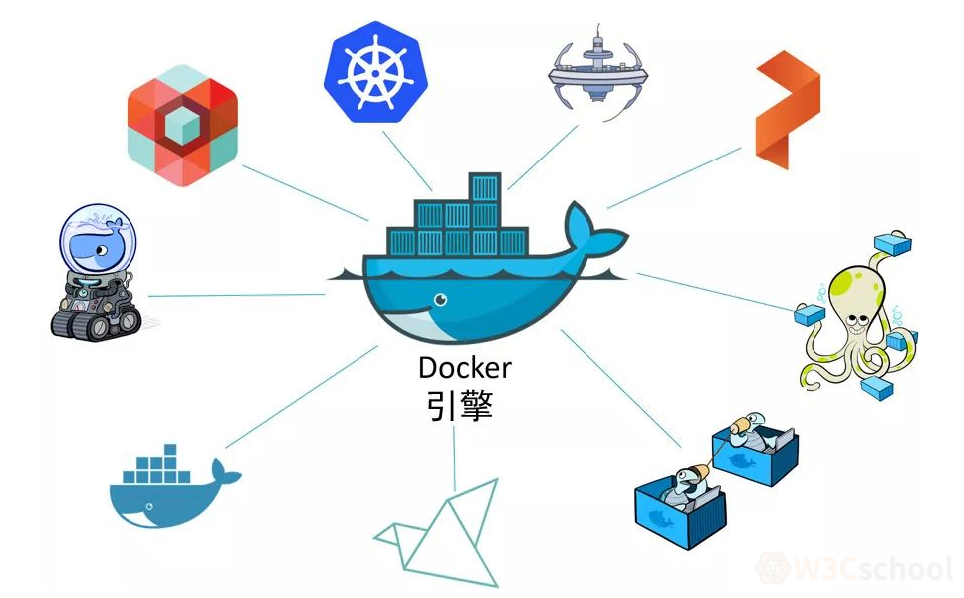


> 目前 Docker引擎主要有两个版本：企业版（EE）和社区版（CE）

**为什么要使用 Docker？**

---
首先，Docker 容器的启动可以在秒级实现，这相比传统的虚拟机方式要快得多。

其次，Docker 对系统资源的利用率很高，一台主机上可以同时运行数千个 Docker 容器。

容器除了运行其中应用外，基本不消耗额外的系统资源，使得应用的性能很高，同时系统的开销尽量小。

传统虚拟机方式运行 10 个不同的应用就要起 10 个虚拟机，而Docker 只需要启动 10 个隔离的应用即可。

具体说来，Docker 在如下几个方面具有较大的优势。

- **更快速的交付和部署**

对开发和运维（devop）人员来说，最希望的就是一次创建或配置，可以在任意地方正常运行。

开发者可以使用一个标准的镜像来构建一套开发容器，开发完成之后，运维人员可以直接使用这个容器来部署代码。

Docker 可以快速创建容器，快速迭代应用程序，并让整个过程全程可见，使团队中的其他成员更容易理解应用程序是如何创建和工作的。 Docker 容器很轻很快！容器的启动时间是秒级的，大量地节约开发、测试、部署的时间。

- **更高效的虚拟化**

Docker 容器的运行不需要额外的 hypervisor 支持，它是内核级的虚拟化，因此可以实现更高的性能和效率。

- **更轻松的迁移和扩展**

Docker 容器几乎可以在任意的平台上运行，包括物理机、虚拟机、公有云、私有云、个人电脑、服务器等。

这种兼容性可以让用户把一个应用程序从一个平台直接迁移到另外一个。

- **更简单的管理**

使用 Docker，只需要小小的修改，就可以替代以往大量的更新工作。

所有的修改都以增量的方式被分发和更新，从而实现自动化并且高效的管理。

- **对比传统虚拟机总结**

|特性	|容器	|虚拟机|
|---|---|---|
|启动	|秒级	|分钟级|
|硬盘使用	|一般为 MB	|一般为 GB|
|性能	|接近原生	|弱于|
|系统支持量	|单机支持上千个容器	|一般几十个|

**Docker的应用场景**
- Web 应用的自动化打包和发布。
- 自动化测试和持续集成、发布。
- 在服务型环境中部署和调整数据库或其他的后台应用。
- 从头编译或者扩展现有的 OpenShift 或 Cloud Foundry 平台来搭建自己的 PaaS 环境。


## 2. Docker安装

**win7、win8 系统安装Docker**

--- 
win7、win8 等需要利用 docker toolbox 来安装，国内可以使用阿里云的镜像来下载.
下载地址：http://mirrors.aliyun.com/docker-toolbox/windows/docker-toolbox/


docker toolbox 是一个工具集，它主要包含以下一些内容：
```text
Docker CLI 客户端，用来运行docker引擎创建镜像和容器
Docker Machine. 可以让你在windows的命令行中运行docker引擎命令
Docker Compose. 用来运行docker-compose命令
Kitematic. 这是Docker的GUI版本
Docker QuickStart shell. 这是一个已经配置好Docker的命令行环境
Oracle VM Virtualbox. 虚拟机
```

下载完成之后直接点击安装，安装成功后，桌边会出现三个图标，入下图所示：

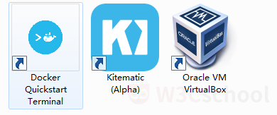

点击 Docker QuickStart 图标来启动 Docker Toolbox 终端。

如果系统显示 User Account Control 窗口来运行 VirtualBox 修改你的电脑，选择 Yes。

第一次打开可能会要下载一些必要的文件, 比较慢, 要耐心等待。

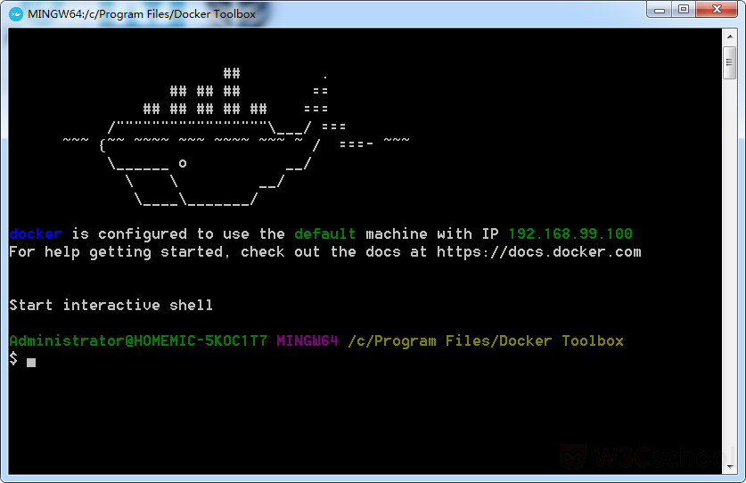

$ 符号那你可以输入以下命令来执行。
:::details 点击打开查看命令
```shell

$ docker run hello-world

Unable to find image 'hello-world:latest' locally

latest: Pulling from library/hello-world

1b930d010525: Pull complete

Digest: sha256:c3b4ada4687bbaa170745b3e4dd8ac3f194ca95b2d0518b417fb47e5879d9b5f

Status: Downloaded newer image for hello-world:latest

Hello from Docker!

This message shows that your installation appears to be working correctly.

To generate this message, Docker took the following steps:

1. The Docker client contacted the Docker daemon.

2. The Docker daemon pulled the "hello-world" image from the Docker Hub.

   (amd64)

3. The Docker daemon created a new container from that image which runs the

   executable that produces the output you are currently reading.

4. The Docker daemon streamed that output to the Docker client, which sent it

   to your terminal.

To try something more ambitious, you can run an Ubuntu container with:

$ docker run -it ubuntu bash

Share images, automate workflows, and more with a free Docker ID:

https://hub.docker.com/

For more examples and ideas, visit:

https://docs.docker.com/get-started/


```
::: 

**Window10安装Docker**

---

**Win10 系统**

现在 Docker 有专门的 Win10 专业版系统的安装包，需要开启Hyper-V。

**开启 Hyper-V**

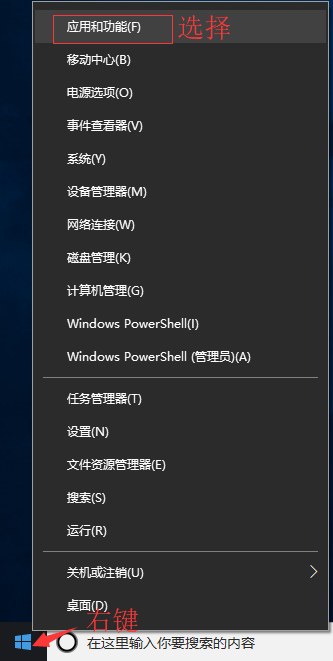
程序和功能


启用或关闭Windows功能


选中Hyper-V

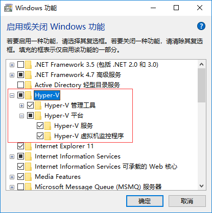

**1、安装 Toolbox**
最新版 Toolbox 下载地址： https://www.docker.com/get-docker

点击 Download Desktop and Take a Tutorial，并下载 Windows 的版本，如果你还没有登录，会要求注册登录：

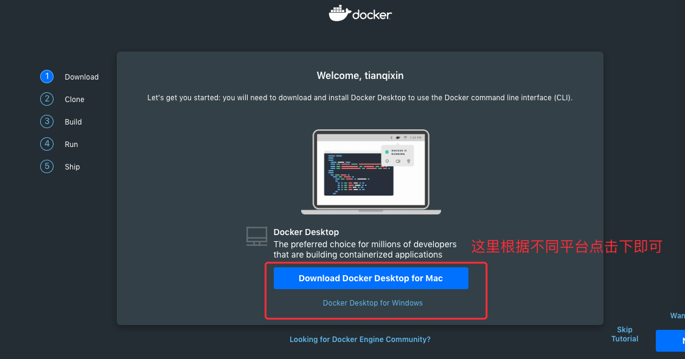

**2、运行安装文件**
双击下载的 Docker for Windows Installer 安装文件，一路 Next，点击 Finish 完成安装。


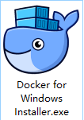
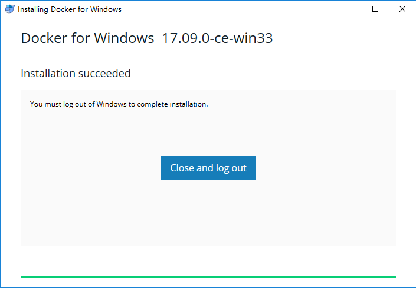


安装完成后，Docker 会自动启动。通知栏上会出现个小鲸鱼的图标 ，这表示 Docker 正在运行。

桌边也会出现三个图标，入下图所示：

我们可以在命令行执行 docker version 来查看版本号，docker run hello-world 来载入测试镜像测试。

如果没启动，你可以在 Windows 搜索 Docker 来启动：

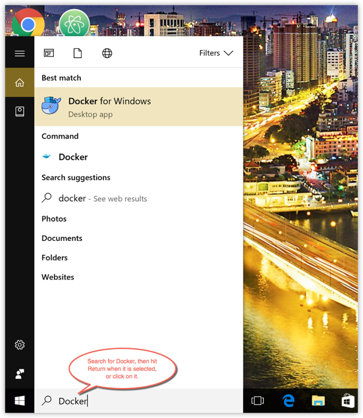

启动后，也可以在通知栏上看到小鲸鱼图标：


**镜像加速**
    
鉴于国内网络问题，后续拉取 Docker 镜像十分缓慢，我们可以需要配置加速器来解决，我使用的是网易的镜像地址：http://hub-mirror.c.163.com。

新版的 Docker 使用 /etc/docker/daemon.json（Linux） 或者 %programdata%\docker\config\daemon.json（Windows） 来配置 Daemon。

请在该配置文件中加入（没有该文件的话，请先建一个）：

```json
{
"registry-mirrors": ["http://hub-mirror.c.163.com"]
}

```
**CentOS Docker 安装**

---

Docker支持以下的CentOS版本：

- CentOS 7 (64-bit)
- CentOS 6.5 (64-bit) 或更高的版本


**前提条件**

目前，CentOS 仅发行版本中的内核支持 Docker。

Docker 运行在 CentOS 7 上，要求系统为64位、系统内核版本为 3.10 以上。

Docker 运行在 CentOS-6.5 或更高的版本的 CentOS 上，要求系统为64位、系统内核版本为 2.6.32-431 或者更高版本。

**使用 yum 安装（CentOS 7下）**

Docker 要求 CentOS 系统的内核版本高于 3.10 ，查看本页面的前提条件来验证你的CentOS 版本是否支持 Docker 。

通过 uname -r 命令查看你当前的内核版本
```shell
uname -r
```

**安装 Docker**

从 2017 年 3 月开始 docker 在原来的基础上分为两个分支版本: Docker CE 和 Docker EE。

Docker CE 即社区免费版，Docker EE 即企业版，强调安全，但需付费使用。

本文介绍 Docker CE 的安装使用。

移除旧的版本：
```shell
$ sudo yum remove docker \
docker-client \
docker-client-latest \
docker-common \
docker-latest \
docker-latest-logrotate \
docker-logrotate \
docker-selinux \
docker-engine-selinux \
docker-engine
```

安装一些必要的系统工具：
```shell
sudo yum install -y yum-utils device-mapper-persistent-data lvm2
```
添加软件源信息：
```shell
sudo yum-config-manager --add-repo http://mirrors.aliyun.com/docker-ce/linux/centos/docker-ce.repo
```
更新 yum 缓存：
```shell
sudo yum makecache fast
```
安装 Docker-ce：
```shell
sudo yum install -y docker-ce
```
启动 Docker 后台服务
```shell
sudo systemctl start docker
```

测试运行 hello-world
```shell
docker run hello-world
```


**使用脚本安装 Docker**
1、使用 sudo 或 root 权限登录 Centos。

2、确保 yum 包更新到最新。

```shell
$ sudo yum update
```

3、执行 Docker 安装脚本。

```shell
$ curl -fsSL https://get.docker.com -o get-docker.sh
$ sudo sh get-docker.sh
```
执行这个脚本会添加 docker.repo 源并安装 Docker。

4、启动 Docker 进程。

```shell
sudo systemctl start docker
```

5、验证 docker 是否安装成功并在容器中执行一个测试的镜像。
```shell
$ sudo docker run hello-world
docker ps
```

到此，Docker 在 CentOS 系统的安装完成。

**镜像加速**

鉴于国内网络问题，后续拉取 Docker 镜像十分缓慢，我们可以需要配置加速器来解决，我使用的是网易的镜像地址：http://hub-mirror.c.163.com。

新版的 Docker 使用 `/etc/docker/daemon.json`（Linux） 或者 `%programdata%\docker\config\daemon.json`（Windows） 来配置 Daemon。

请在该配置文件中加入（没有该文件的话，请先建一个）：
```json
{
"registry-mirrors": ["http://hub-mirror.c.163.com"]
}
```

**删除 Docker CE**

执行以下命令来删除 Docker CE：
```shell
$ sudo yum remove docker-ce
$ sudo rm -rf /var/lib/docker
```
**MacOS Docker 安装**

---

**使用 Homebrew 安装**

macOS 我们可以使用 Homebrew 来安装 Docker。

Homebrew 的 Cask 已经支持 Docker for Mac，因此可以很方便的使用 Homebrew Cask 来进行安装：
```shell

$ brew cask install docker

==> Creating Caskroom at /usr/local/Caskroom
==> We'll set permissions properly so we won't need sudo in the future
Password:          # 输入 macOS 密码
==> Satisfying dependencies
==> Downloading https://download.docker.com/mac/stable/21090/Docker.dmg
######################################################################## 100.0%
==> Verifying checksum for Cask docker
==> Installing Cask docker
==> Moving App 'Docker.app' to '/Applications/Docker.app'.
&#x1f37a;  docker was successfully installed!
```
在载入 Docker app 后，点击 Next，可能会询问你的 macOS 登陆密码，你输入即可。之后会弹出一个 Docker 运行的提示窗口，状态栏上也有有个小鲸鱼的图标（）。

**手动下载安装**

如果需要手动下载，请点击以下链接下载 Stable 或 Edge 版本的 Docker for Mac。

如同 macOS 其它软件一样，安装也非常简单，双击下载的 .dmg 文件，然后将鲸鱼图标拖拽到 Application 文件夹即可。

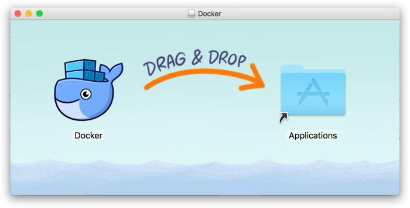

从应用中找到 Docker 图标并点击运行。可能会询问 macOS 的登陆密码，输入即可。

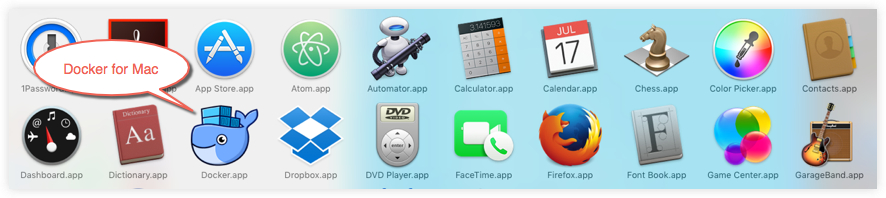

点击顶部状态栏中的鲸鱼图标会弹出操作菜单。


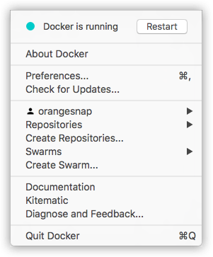

第一次点击图标，可能会看到这个安装成功的界面，点击 "Got it!" 可以关闭这个窗口。

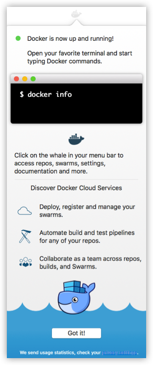

启动终端后，通过命令可以检查安装后的 Docker 版本。

```shell
$ docker --version
Docker version 17.09.1-ce, build 19e2cf6
```
**镜像加速**

鉴于国内网络问题，后续拉取 Docker 镜像十分缓慢，我们可以需要配置加速器来解决，我使用的是网易的镜像地址：http://hub-mirror.c.163.com。

在任务栏点击 Docker for mac 应用图标 -> Perferences... -> Daemon -> Registry mirrors。在列表中填写加速器地址即可。修改完成之后，点击 Apply & Restart 按钮，Docker 就会重启并应用配置的镜像地址了。

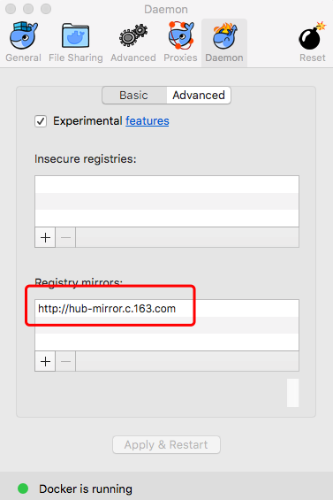

之后我们可以通过 docker info 来查看是否配置成功。
```shell
$ docker info
...
Registry Mirrors:
http://hub-mirror.c.163.com
Live Restore Enabled: false
```