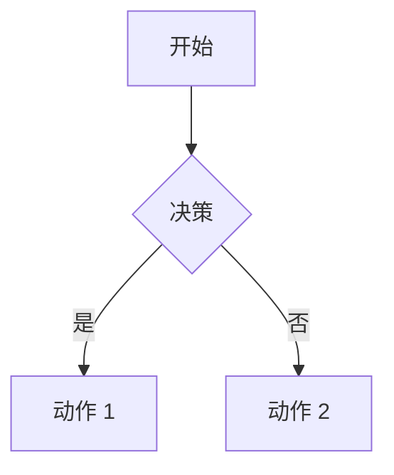

# vitepress使用vitepress-plugin-legend
> 说明：`vitepress`本身不支持`mermaid`语言转换，为了支持页面中显示`UML`图像，项目中引入了`vitepress-plugin-legend`插件，本文也是围绕这个插件展开。

## ✨ 插件特性

- 🗺️ **Markmap 集成**: Markdown 思维导图交互式预览
- 🏞️ **Mermaid 集成**: 交互式图表（流程图、时序图等），支持缩放功能
- 📊 **Infographic 集成**: AntV Infographic 信息图表数据可视化，支持缩放功能
- 🔍 **缩放支持**: Mermaid 和 Infographic 图表内置缩放和拖拽功能
- 🎨 **可定制**: 三个插件都支持灵活的配置选项
- 🔧 **简单设置**: 单个插件安装，统一配置
- 📁 **组件支持**: 提供 Markmap、Mermaid 和 Infographic 的 Vue 组件
- 🚀 **TypeScript**: 完整的 TypeScript 支持和类型定义


## 📦 安装

```bash
npm install vitepress-plugin-legend
# 或
pnpm add vitepress-plugin-legend
# 或
yarn add vitepress-plugin-legend
```

## 🚀 快速开始
### 步骤 1：配置 VitePress

在 VitePress 配置中添加插件：
```typescript
// .vitepress/config.mts
import { defineConfig } from 'vitepress'
import { vitepressPluginLegend } from 'vitepress-plugin-legend';


// https://vitepress.dev/reference/site-config
export default defineConfig({
    markdown: {
        config(md) {
            vitepressPluginLegend(md,{
                markmap: {
                    showToolbar: true,
                    // Other markmap options
                },
                mermaid: true, // or false to disable
                infographic: {
                    showToolbar: true,
                    // Other infographic options
                },
            });
        },
    }
})

```

### 步骤 2：注册组件

在主题中注册 Vue 组件：

```typescript
// .vitepress/theme/index.ts
import type { Theme } from 'vitepress';
import DefaultTheme from 'vitepress/theme'
import { initComponent } from 'vitepress-plugin-legend/component';

import './custom.css' // <--- 关键步骤：引入自定义样式
import 'vitepress-plugin-legend/dist/index.css';

export default {
    extends: DefaultTheme,
    enhanceApp({ app }) {
        initComponent(app);
    },
} satisfies Theme;
```
## 📖 在 Markdown 中使用

### Markmap

从 Markdown 列表创建思维导图：

````markdown
```markmap
# 根节点
## 分支 1
- 项目 1
- 项目 2
## 分支 2
- 项目 A
- 项目 B
```
````
```markmap
# 根节点
## 分支 1
- 项目 1
- 项目 2
## 分支 2
- 项目 A
- 项目 B
```
```markdown
<PreviewMarkmapPath path="./other.md" showToolbar />
<PreviewMarkmapPath />
````

### Mermaid

创建各种图表：

````markdown

````

```markdown
<PreviewMermaidPath path="./other.mmd" />
```


### Infographic

创建 AntV Infographic 信息图表：

````markdown
```infographic
infographic list-row-simple-horizontal-arrow
data
  title 示例流程
  items
    - label 步骤 1
      desc 开始
    - label 步骤 2
      desc 进行中
    - label 步骤 3
      desc 完成
```
````

```infographic
infographic list-row-simple-horizontal-arrow
data
  title 示例流程
  items
    - label 步骤 1
      desc 开始
    - label 步骤 2
      desc 进行中
    - label 步骤 3
      desc 完成
```

从文件加载：

```markdown
<PreviewInfographicPath path="./chart.igf" />

<PreviewInfographicPath path="./chart.igf" showToolbar />
```

## 📦 子包

此插件集成了以下包：

| 包名                                                                      | 说明                              | 版本                                                                   |
| ------------------------------------------------------------------------- | --------------------------------- | ---------------------------------------------------------------------- |
| [vitepress-markmap-preview](./packages/vitepress-markmap-preview)         | Markdown 思维导图预览插件         |      |
| [vitepress-mermaid-preview](./packages/vitepress-mermaid-preview)         | Markdown Mermaid 图表预览插件     |      |
| [vitepress-infographic-preview](./packages/vitepress-infographic-preview) | AntV Infographic 信息图表预览插件 |  |


